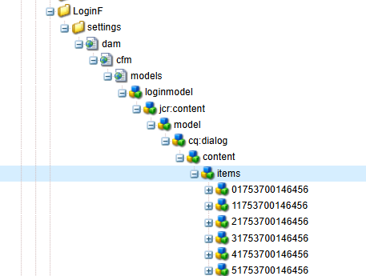

<h1 align="center">AEM Content Fragment Generator</h1>

<p align="center">
  
  
  

</p>

<p align="cente">
A powerful VS Code extension that simplifies **Adobe Experience Manager** (AEM) Content Fragment Model creation with an intuitive visual interface. Generate complete Content Fragment Model structures with proper XML configurations in seconds.
</p>

---

## ✨ Features

- 🚀 **Visual Model Builder** - Intuitive UI for creating Content Fragment Models
- 📋 **Multiple Field Types** - Supports text, rich text, number, boolean, date/time, and enumeration fields
- ⚙️ **Validation Rules** - Set required/optional validation for each field
- 🎨 **Responsive Design** - Works seamlessly across different screen sizes
- 📁 **Project Structure** - Generates complete folder structure with proper `.content.xml` files
- 🔍 **Live Preview** - Preview your model structure before generation
- 🛠 **Customizable** - Configure default field types and validation rules

---

## 📦 Installation

1. Open **Visual Studio Code**
2. Go to Extensions view (`Ctrl+Shift+X`)
3. Search for `"AEM Content Fragment Generator"`
4. Click **Install**

---

## 🚀 Quick Start

1. 🖱 Right-click on a folder in your workspace
2. Select `AEM: Create Content Fragment Model`.
3. 🎨 Fill in the following details:
   - **Project Name**: Your AEM project name (lowercase, numbers, and hyphens only)
   - **CF Folder Name**: Name for your content fragment folder
   - **CF Model Name**: Name for your content fragment model
4. **Add fields** to your model:
   - Click **+ Add Field**
   - Enter field name
   - Select field type (text, rich text, number, boolean, date/time, enumeration)
   - Set validation (required/optional)
   - Add default value if needed
5. **👀 Preview** your model structure
6. ⚡ Click **Generate** to create the files
   

---

## 🧩 Supported Field Types

| Field Type       | Description          | Example                      |
| ---------------- | -------------------- | ---------------------------- |
| Single Line Text | Plain text input     | Page title, Author name      |
| Multi-line Text  | Rich text editor     | Article content, Description |
| Number           | Numeric input        | Quantity, Rating             |
| Boolean          | True/False toggle    | Is Featured, Is Active       |
| Date/Time        | Date and time picker | Publish date, Event time     |
| Enumeration      | Dropdown selection   | Status, Category             |

---

## 🧱 Example Output Structure



```plaintext
my-cf-folder/
├── .content.xml
└── settings/
    ├── .content.xml
    └── dam/
        ├── .content.xml
        └── cfm/
            ├── .content.xml
            └── models/
                ├── .content.xml
                └── my-article/
                    └── .content.xml
```

---

## 🤝 Contributing

Contributions are welcome! If you have suggestions, issues, or ideas, feel free to open an issue or submit a Pull Request.

---

## 📄 License

This project is licensed under the **MIT License** – see the [LICENSE](https://github.com/PRADEEP0573/AEM-Content-Fragment-Generator/blob/main/LICENSE) file for details.

---

## 👨‍💻 About the Author

<p align="center">
  <br><br>
  <strong>Pradeep Sapparapu</strong><br>
  <i>"I created this tool to make AEM development faster and more efficient. It's 100% free and open-source — share it with your team!"</i><br><br>
  <i>Made with ❤️ in Andhra Pradesh, India 🇮🇳</i><br>
  🔗 <a href="https://github.com/PRADEEP0573">GitHub</a> • 
  📧 <a href="mailto:pradeepdeep057@gmail.com">Email Me</a>  
</p>

---

## 🙏 Support

If you find this tool helpful, please ⭐ star the repository and share it with your team!
You can also [follow me on GitHub](https://github.com/PRADEEP0573/AEM-Content-Fragment-Generator) for more AEM tools and updates.

<div style="text-align: center; margin: 20px 0;">
<a href="https://www.buymeacoffee.com/FilesCompareMaster"></a>
</div>

---

<div style="text-align: center; margin: 20px 0;">© 2025 Padde Software. All rights reserved.</div>
